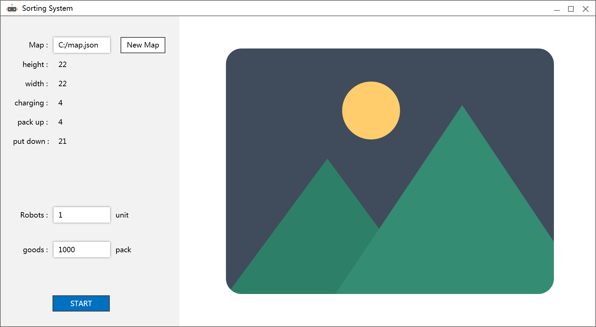

# Sorting_System

## 简介
物流分拣系统，该工程是为模拟物流公司分拣机器人运行工作的仿真系统。
- 语言：JAVA
- 开发环境：IntelliJ IDEA Community Edition

## 总体设计
分拣机器人的工作行为通过动画的方式模拟，借助JAVA awt软件包将每一帧图像绘制出来，最终将系统的运行过程可视化。

#### 功能需求：
1. 分拣机器人数量可控
2. 分拣区域可规划
3. 物流分拣结果可统计

#### 界面设计： 

#### logo：

## 程序设计
#### 机器人对象：
| 说明          | 类型          | 名称  |
| ------------- |:-------------:|:-----|
| 高度          | int           | height |
| 宽度          | int           | width  |
| 坐标点        | Point         | point  |
| 速度          | int           | speed  |
| 转速          | int           | spin   |
| 转速          | int           | spin   |